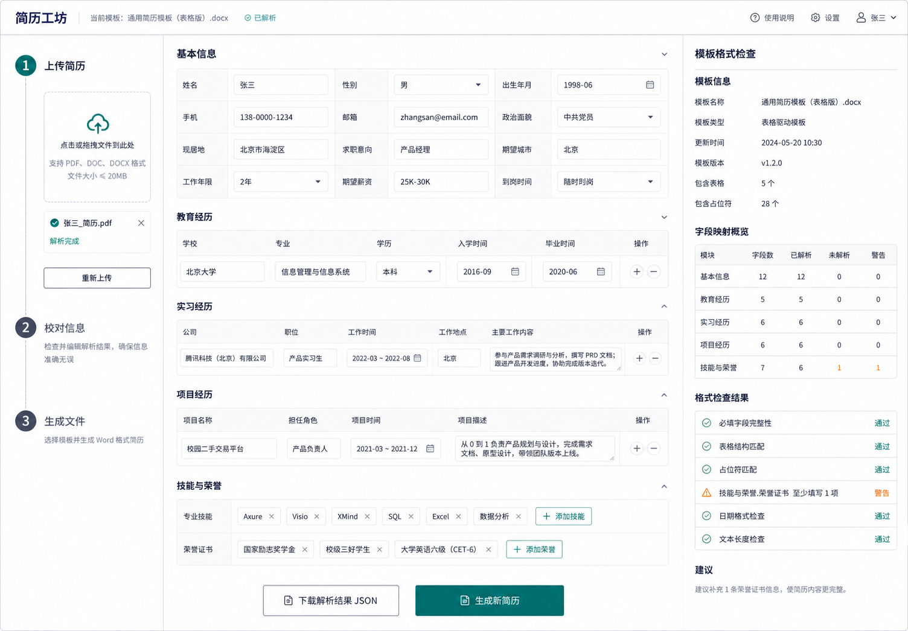
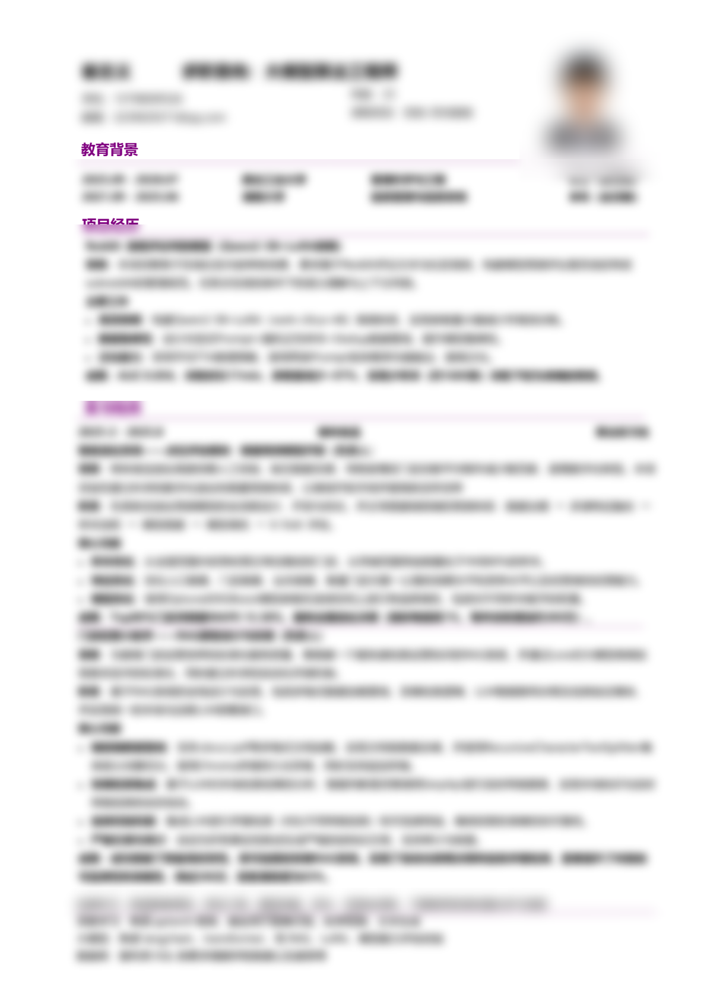
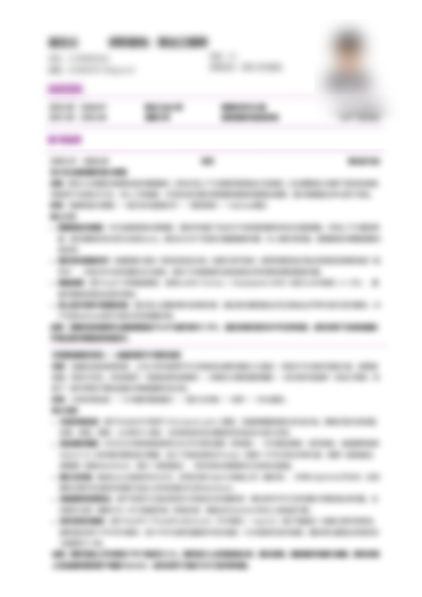

# 简历工坊（Resume Workshop）

一个本地运行的 Word 简历解析与格式转换工具。它可以读取 `.docx` / `.docm` 简历，也可以把一段个人介绍、教育、项目或工作经历解析成结构化表单；用户校对后，可生成统一模板的 Word 简历。

> 所有简历数据默认只在本机处理。智能解析固定使用本地 Ollama 模型 `qwen3:4b`，不会把简历发送给远程大模型服务。

本仓库同时是一个可安装的 Codex Skill：Codex 可以直接调用本地 CLI 完成“解析 → 校对 → 生成”，无需启动网页服务。

## 在 Codex 中安装

在 Codex 中调用内置安装器，并提供本仓库地址：

```text
$skill-installer Install the resume-workshop skill from https://github.com/2024Czy/Resume-Generator-System
```

安装后可显式调用：

```text
$resume-workshop 解析这份 Word 简历，列出不确定字段，等我确认后生成格式统一的 DOCX。
```

Codex 也可以根据任务描述自动选择该技能。技能定义见 [`SKILL.md`](SKILL.md)，结构化字段见 [`references/resume-schema.md`](references/resume-schema.md)。

技能模式仅需 Python 依赖：

```bash
python -m pip install -r requirements.txt
python scripts/resume_cli.py --help
```

## 网站预览

网页端提供“导入资料 → 校对信息 → 生成文件”的完整工作流：左侧导入 Word 或文本，中间校对结构化简历，右侧检查模板字段与格式状态。



## 解析前后简历对比（脱敏）

下面保留同一份 Word 简历的版式对比：左侧为解析前的原始简历，右侧为解析后经过字段整理并套用统一模板的简历。为保护隐私，示例图片中的姓名、联系方式、学校、公司、项目经历等具体文字已做模糊处理，照片也已加重模糊；标题层级、分隔线、段落密度、对齐方式和分页结构均予以保留。

| 解析前：原始简历（脱敏） | 解析后：格式化简历（脱敏） |
|---|---|
|  |  |

对比重点包括：个人信息字段提取、教育经历对齐、项目/实习内容分段、技能与荣誉归类，以及照片和分页版式的统一处理。原始文件和生成文件仅作为本地演示来源，不在 README 中展示真实文件名或个人信息。

## 主要功能

- 解析普通段落、表格、DrawingML/VML 文本框及混合排版的 Word 简历。
- 支持上传不超过 20 MB 的 `.docx` 和 `.docm` 文件。
- 支持粘贴最多 50,000 字文本并自动填写表单。
- 提供两种文本解析模式：
  - **智能解析**：`qwen3:4b` 语义抽取、原文证据校验和确定性规则合并。
  - **快速解析**：只使用本地规则，无需安装 Ollama。
- Ollama 不可用时自动回退快速解析，并显示实际引擎与回退原因。
- 支持在网页中修改个人信息、教育、项目、实习、技能和荣誉。
- 支持下载结构化 JSON，或生成统一格式的 `.docx` 简历。
- 使用匿名公开模板，不包含真实人员的姓名、电话、邮箱或教育经历。

## 技术栈

| 模块 | 技术 |
|---|---|
| 后端 | Python、FastAPI、Pydantic |
| Word 处理 | lxml、Pillow、OOXML |
| 前端 | React、Vite、Lucide React |
| 本地模型 | Ollama、`qwen3:4b` |

## 项目结构

```text
.
├─ backend/                         后端接口、解析器和 Word 生成器
├─ frontend/                        React 前端源码
├─ agents/openai.yaml               Codex 技能展示与调用元数据
├─ references/resume-schema.md      结构化简历字段说明
├─ scripts/resume_cli.py            Codex/命令行入口
├─ templates/
│  └─ resume-template-public.docm   匿名公开 Word 模板
├─ SKILL.md                         Codex 技能定义
├─ .gitignore
├─ README.md
└─ requirements.txt
```

## 环境要求

- Python 3.11+
- Node.js 20.19+ 或 22.12+
- pnpm 11+
- Ollama（仅智能解析需要）

Microsoft Word 不是程序运行依赖，但建议使用 Word 或兼容软件检查最终导出的版式。

## 安装与启动

### 1. 获取项目

```bash
git clone <repository-url>
cd <repository-directory>
```

### 2. 安装后端依赖

Windows PowerShell：

```powershell
python -m venv .venv
.\.venv\Scripts\Activate.ps1
python -m pip install --upgrade pip
pip install -r requirements.txt
```

macOS / Linux：

```bash
python3 -m venv .venv
source .venv/bin/activate
python -m pip install --upgrade pip
pip install -r requirements.txt
```

### 3. 构建前端

```bash
cd frontend
corepack enable
pnpm install --frozen-lockfile
pnpm build
cd ..
```

### 4. 准备本地模型（可选）

如果只使用快速解析，可以跳过此步骤。

```bash
ollama pull qwen3:4b
ollama list
```

Ollama 桌面版通常会自动启动服务。如果 `http://127.0.0.1:11434` 无法访问，可在单独终端执行：

```bash
ollama serve
```

### 5. 启动应用

```bash
uvicorn backend.app:app --host 127.0.0.1 --port 8000
```

浏览器访问：

```text
http://127.0.0.1:8000
```

生产启动时，FastAPI 会直接托管已经构建好的 `frontend/dist`。

## 开发模式

启动后端热更新：

```bash
uvicorn backend.app:app --reload --host 127.0.0.1 --port 8000
```

在另一个终端启动前端：

```bash
cd frontend
pnpm install --frozen-lockfile
pnpm dev
```

访问 `http://127.0.0.1:5173`。Vite 会把 `/api` 请求代理到 `http://127.0.0.1:8000`。

## 使用方式

### 上传 Word 简历

1. 选择“上传 Word”。
2. 上传 `.docx` 或 `.docm` 文件。
3. 检查系统识别出的个人信息和经历。
4. 修正缺失字段或低置信字段。
5. 点击“生成新简历”下载结果。

### 粘贴文本生成简历

1. 选择“粘贴文本”。
2. 粘贴个人介绍、教育、项目、实习或工作经历。
3. 选择“智能解析”或“快速解析”。
4. 选择替换当前内容或与现有表单合并。
5. 点击识别按钮并等待表单回填。
6. 查看实际解析引擎、原文依据和低置信提示。
7. 完成人工校对后生成 Word 文件。

`qwen3:4b` 在纯 CPU 环境中处理长文本可能需要几十秒到数分钟。后端会流式接收模型输出，不会因为等待完整 JSON 的总时间较长而误报连接失败。

## 配置项

| 环境变量 | 默认值 | 说明 |
|---|---|---|
| `RESUME_TEMPLATE_PATH` | `templates/resume-template-public.docm` | Word 模板路径 |
| `OLLAMA_BASE_URL` | `http://127.0.0.1:11434` | Ollama 服务地址 |
| `OLLAMA_TIMEOUT_SECONDS` | `300` | 连续未收到模型数据时的超时秒数 |

PowerShell 示例：

```powershell
$env:OLLAMA_TIMEOUT_SECONDS='600'
$env:RESUME_TEMPLATE_PATH='D:\templates\my-template.docm'
uvicorn backend.app:app --host 127.0.0.1 --port 8000
```

macOS / Linux 示例：

```bash
OLLAMA_TIMEOUT_SECONDS=600 \
RESUME_TEMPLATE_PATH=/path/to/template.docm \
uvicorn backend.app:app --host 127.0.0.1 --port 8000
```

## API

启动后访问 `http://127.0.0.1:8000/docs` 可查看 FastAPI 交互式接口文档。

| 方法 | 路径 | 说明 |
|---|---|---|
| `GET` | `/api/health` | 检查服务和模板状态 |
| `GET` | `/api/ai-status` | 检查 Ollama 与模型状态 |
| `GET` | `/api/template-profile` | 获取模板结构信息 |
| `POST` | `/api/parse` | 上传并解析 Word 文件 |
| `POST` | `/api/parse-text` | 解析粘贴文本 |
| `POST` | `/api/generate` | 生成 Word 简历 |

文本解析请求示例：

```bash
curl -X POST http://127.0.0.1:8000/api/parse-text \
  -H "Content-Type: application/json" \
  -d '{"engine":"hybrid","text":"姓名：张三，毕业于示例大学。"}'
```

将 `engine` 设置为 `rules` 可直接使用快速解析。


## 已知限制

- 暂不支持旧式 `.doc`、PDF、扫描件和图片简历。
- 默认生成逻辑针对仓库中的表格模板；完全不同的模板需要单独适配。
- 小参数本地模型仍可能出现字段遗漏或分类错误，生成前必须人工校对。
- 长文本在 CPU 环境中的推理速度取决于本机硬件。

## License

本项目由 **2024Czy** 与 **pfr** 共同发布，采用 [MIT License](LICENSE)。
